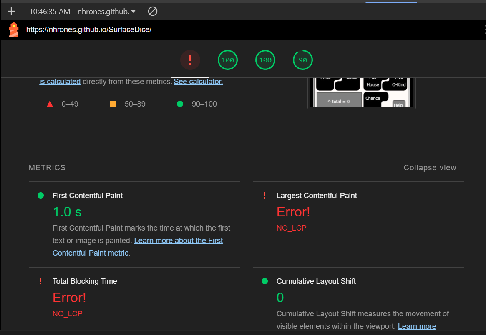

# Surface Framework  
## Canvas GUI  
## Dice Game Example

Yes it's my same old poker-dice game you've all seen on many platforms.    
Now, its back on my newly updated Surface framework!

Once again:
  - Single DOM element! `<canvas>`
  - Ultra-fine-grained reactivity! `signals-aggregator`
  - Zero external dependencies -- none - nada
  - Pure vanilla HTML, CSS, javescript
  - Bundled framework + view components ~25 KB
  - This example with framework + all media < 152 KB
## Performance
To fast for lighthouse   



## Usage:
```
Click the 'Roll Button' to start.    
After each roll of the dice, you can 'click' a die to 'freeze' its value.    
Click again to toggle the frozen state. When frozen, value will be held!
After three rolls, you must select a score item.  
The blue highlighted numbers indicate possible scores that are available to select.
Have fun!
```
## NOTE: Try it now!
## https://nhrones.github.io/SurfaceDice/

Copyright 2022-2025, Nick D. Hrones, All rights are reserved.